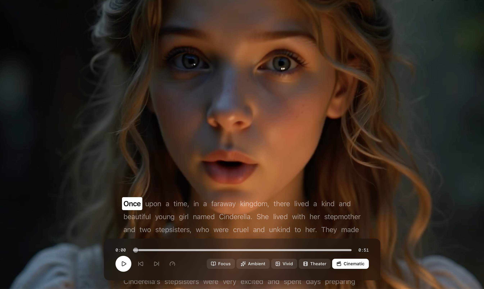

# OpenReader

> **Bring life to any text or topic!** Transform any content into immersive, narrated experiences.

<div align="center">
  
</div>

<br />

OpenReader is an advanced text-to-speech platform that goes beyond simple narration. Choose how you want to learn: follow along with interactive text highlighting, watch AI-generated characters narrate your content, immerse yourself in contextual imagery, or combine them all. Built with Next.js and powered by cutting-edge AI APIs.

## ✨ Features

### 🎙️ **Smart Text-to-Speech**
- Dual TTS engines (ElevenLabs + SLNG.AI) for natural-sounding narration
- Perfect word-level synchronization with character-based timing
- Adjustable playback speed (0.5x - 2x)

### 🎬 **Multiple Learning Modes**
- **Focus** - Clean text with synchronized highlighting
- **Ambient** - Contextual AI-generated images above your text
- **Vivid** - Full-screen immersive backgrounds
- **Theater** - Small AI lipsync narrator video alongside text
- **Cinematic** - Full-screen talking character video with text overlay

### 🔗 **URL Content Extraction**
- Paste any article URL and automatically extract clean content
- Powered by Linkup API for reliable web scraping

### 🎮 **Advanced Playback Controls**
- Click any word to jump to that moment
- Seekable progress slider with YouTube-style loading bar
- Skip forward/backward controls
- Real-time word highlighting with smooth animations

### 🤖 **AI-Powered Immersion**
- Context-aware image generation (Runware)
- AI lipsync video generation (VEED Lipsync)
- Full talking character videos (VEED Fabric)
- Automatic scene detection and switching

### 💾 **Smart Caching & Optimization**
- In-memory caching for images, videos, and audio
- Request resumability (reload page without losing progress)
- Progressive loading for seamless experience
- Demo mode with pre-generated content

### 🔄 **Seamless Experience**
- Video looping until next scene is ready
- Auto-scrolling text synchronized with narration
- Responsive design for mobile and desktop
- Share functionality with URL parameters

## Quick Start

1. **Install dependencies:**
   ```bash
   bun install
   ```

2. **Set up your API keys:**
   Create a `.env.local` file:
   ```bash
   # Required for TTS
   SLNG_API_KEY=your_slng_api_key_here
   ELEVENLABS_API_KEY=your_elevenlabs_api_key_here
   
   # Required for immersion images
   RUNWARE_API_KEY=your_runware_api_key_here
   
   # Required for URL content extraction
   LINKUP_API_KEY=your_linkup_api_key_here
   
   # Required for AI videos (Theater & Cinematic modes)
   FAL_KEY=your_fal_api_key_here
   ```
   - Get SLNG API key at [slng.ai](https://slng.ai)
   - Get ElevenLabs API key at [elevenlabs.io](https://elevenlabs.io)
   - Get Runware API key at [runware.ai](https://runware.ai)
   - Get Linkup API key at [linkup.so](https://www.linkup.so)
   - Get fal.ai API key at [fal.ai](https://fal.ai) (for VEED Lipsync and Fabric)

3. **Run the development server:**
   ```bash
   bun dev
   ```

4. **Open your browser:**
   Navigate to [http://localhost:3000](http://localhost:3000)

## How It Works

1. **Input your content:**
   - Enter text directly in the Text tab
   - Paste a URL in the URL tab to extract article content automatically
   - Or click "Use Demo" to try with Cinderella story

2. **Choose your provider:**
   - ElevenLabs (best quality, character-level timestamps)
   - SLNG.AI (faster, good quality)

3. **Select your immersion mode:**
   - **Focus** - Distraction-free reading with text highlighting
   - **Ambient** - Contextual images appear above the text
   - **Vivid** - Full-screen atmospheric backgrounds
   - **Theater** - Split view with AI lipsync narrator video
   - **Cinematic** - Full-screen AI-generated talking character

4. **Start playback:**
   - Click Play to start narration
   - Watch as each word is highlighted in real-time
   - Click any word or drag the slider to jump to that position
   - Videos automatically loop until next scene is ready

5. **Share your experience:**
   - Click the Share button to get a shareable link
   - Recipients will load the same text and immersion mode

## Tech Stack

### Frontend
- **Next.js 15** - React framework with App Router and Turbopack
- **React 19** - UI library with modern hooks
- **TypeScript** - Type-safe development
- **shadcn/ui** - Beautiful, accessible component library
- **Tailwind CSS** - Utility-first styling
- **Framer Motion** - Smooth animations for word highlighting

### AI & APIs
- **ElevenLabs API** - Premium TTS with character-level timestamps
- **SLNG.AI API** - High-quality TTS for faster processing
- **Runware API** - AI image generation (FLUX.1 model)
- **VEED Lipsync (fal.ai)** - AI lipsync video generation for Theater mode
- **VEED Fabric (fal.ai)** - Full talking character videos for Cinematic mode
- **Linkup API** - Intelligent web content extraction

### Performance & Optimization
- **Bun** - Fast JavaScript runtime and package manager
- **In-memory caching** - Images, videos, and audio caching
- **Queue-based processing** - Polling for long-running video generation
- **Progressive loading** - Seamless UX with background resource loading

## Project Structure

```
├── app/
│   ├── api/
│   │   ├── tts/          # Dual TTS provider (ElevenLabs + SLNG.AI)
│   │   ├── immersion/    # AI image generation (Runware)
│   │   ├── lipsync/      # AI lipsync videos (VEED Lipsync)
│   │   ├── fabric/       # AI talking videos (VEED Fabric)
│   │   └── linkup/       # Web content extraction
│   ├── page.tsx          # Main application orchestration
│   └── layout.tsx        # Root layout with metadata
├── components/
│   ├── reader/
│   │   ├── reader-layout.tsx       # Main layout with immersion modes
│   │   ├── reader-display.tsx      # Text display with word highlighting
│   │   ├── player-controls.tsx     # Playback controls
│   │   ├── text-input.tsx          # Text/URL input with tabs
│   │   ├── immersion-selector.tsx  # Mode selector UI
│   │   ├── provider-selector.tsx   # TTS provider selector
│   │   └── share-button.tsx        # Share functionality
│   └── ui/               # shadcn components
├── hooks/
│   └── use-audio-manager.ts  # Audio playback, sync, and seeking
└── lib/
    ├── text-utils.ts          # Text chunking and word indexing
    ├── elevenlabs-utils.ts    # Timestamp conversion utilities
    └── types.ts               # TypeScript type definitions
```

## Key Features Explained

### Immersion Modes Architecture
- **Focus**: Clean text-only experience with synchronized highlighting
- **Ambient**: Sticky 16:9 images at top with auto-scrolling text
- **Vivid**: Full-screen background images with glassmorphic text overlay
- **Theater**: Split view - background image + small lipsync narrator video + text
- **Cinematic**: Full-screen talking character video with text overlay at bottom

### Caching Strategy
- **Images**: In-memory Map cache (scene-based with text hash)
- **Videos**: Dual cache - completed videos + pending request IDs
- **Audio**: URL-based caching with analysis results
- **URL Content**: Normalized URL caching for extracted content

### Scene Management
- Text divided into 150-word scenes
- Progressive loading: first scene activates mode immediately
- Background loading: subsequent scenes load while reading
- Smart advancement: only switches scenes when resources are ready
- Video looping: current video loops until next scene is available

## Credits

Created by [@patriciobcs](https://github.com/patriciobcs) for HackBarna 🏆

Built with ❤️ using Next.js, ElevenLabs, SLNG.AI, Runware, VEED.io (via fal.ai), and Linkup
